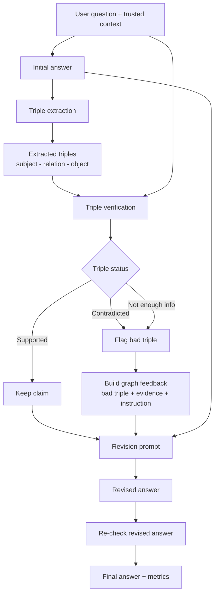

# grapheval_prototype

A small **GraphEval-style hallucination feedback** prototype for undergraduate research. The system runs an external loop around an LLM: extract factual triples from an answer, verify them against trusted context, build structured feedback for failures, and revise the answer.

## Goal

Reduce hallucinations by giving the model **triple-level feedback** instead of a generic “try again” prompt. Each unsupported or contradicted fact is flagged with evidence from the trusted context before revision.

The prototype also runs a **self-correction baseline** so you can compare:

- **Self-correction** — generic “check your answer against the context” revision
- **Graph-feedback correction** — revision driven by specific unsupported/contradicted triples

## Architecture diagram



## Implementation status

- CLI prototype working with mock and Ollama/Gemma4.
- FastAPI backend working (`/health`, `/examples`, `/run`, `/run-custom`, `/run-all`).
- Next.js frontend working with single-run, run-all, and custom input.
- Pipeline supports triple extraction, verification, graph feedback, revision, and self-correction baseline.
- Post-revision re-verification counts remaining bad triples after graph-feedback revision.
- Optional Neo4j storage for verified triples (`NEO4J_ENABLED=true`).
- **Next step:** formal comparison study — self-correction vs triple-level graph feedback.

## Project layout

```
grapheval_prototype/
├── scripts/
│   ├── start-dev.sh            # One-command local demo (Neo4j + API + UI)
│   └── stop-dev.sh             # Stop tracked processes + Neo4j container
├── api/server.py               # FastAPI wrapper
├── frontend/                   # Next.js demo UI
├── data/examples.json          # Test examples (6 domains)
├── prompts/                    # LLM prompt templates
├── results/                    # Saved JSON outputs (gitignored)
└── src/                        # Python pipeline (source of truth)
```

## Requirements

Python 3.10+. Node.js 18+ for the web UI.

```bash
pip install -r requirements.txt
```

## Install and run Ollama

```bash
ollama serve
ollama pull gemma4:e2b
ollama pull gemma4:e4b
ollama pull gemma4:12b
```

Text-only prompts — image input is not used even if the model supports it.

## Neo4j storage

Verified triples can be persisted to Neo4j **after** the existing LLM verification step. Neo4j is **not** used as the verifier — it only stores results.

Start a local Neo4j instance:

```bash
docker run \
  --name grapheval-neo4j \
  -p 7474:7474 -p 7687:7687 \
  -e NEO4J_AUTH=neo4j/password123 \
  neo4j:latest
```

Enable storage when running the pipeline:

```bash
export NEO4J_ENABLED=true
export NEO4J_URI=bolt://localhost:7687
export NEO4J_USER=neo4j
export NEO4J_PASSWORD=password123

python -m src.main --provider mock
```

Graph model:

- `(:Entity {name})` nodes for subject and object (merged by name)
- `[:CLAIM {relation, label, reason, evidence, example_id, answer_stage}]` relationships

Each pipeline run stores:

- `answer_stage="initial"` — triples from the initial answer
- `answer_stage="graph_revised"` — triples after graph-feedback revision (if revision occurred)

If Neo4j is enabled but unavailable, the pipeline prints a warning and continues normally.

Browse the graph at [http://localhost:7474](http://localhost:7474) (default auth: `neo4j` / `password123`).

Example Cypher query:

```cypher
MATCH (s:Entity)-[c:CLAIM]->(o:Entity)
WHERE c.example_id = "hyundai_sonata_001"
RETURN s.name, c.relation, o.name, c.label, c.answer_stage
```

### Viewing stored Neo4j claims

After running examples with `NEO4J_ENABLED=true`, you can inspect stored `CLAIM` relationships via the API or Neo4j Browser.

**API** (with the FastAPI server running):

- All claims: [http://localhost:8000/graph/claims](http://localhost:8000/graph/claims)
- Filter by example: `http://localhost:8000/graph/claims?example_id=hyundai_sonata_001`
- Bad claims only: [http://localhost:8000/graph/bad-claims](http://localhost:8000/graph/bad-claims)

The Next.js UI walks through the pipeline in order: original answer → flagged claims → revised answer → baseline comparison → stored Neo4j claims. Full triple tables and JSON are under **Advanced details**.

If Neo4j is disabled or unavailable, these endpoints return JSON with an empty `claims` list and an `error` message instead of failing the request.

**Neo4j Browser** Cypher:

```cypher
MATCH (s:Entity)-[c:CLAIM]->(o:Entity)
RETURN
  s.name AS subject,
  c.relation AS relation,
  o.name AS object,
  c.label AS label,
  c.reason AS reason,
  c.evidence AS evidence,
  c.example_id AS example_id,
  c.answer_stage AS answer_stage
LIMIT 50;
```

## KGc backtracking flow

Professor-confirmed scaffold for graph-grounded evaluation and backtracking (separate from the original GraphEval pipeline):

```
Context + Question → Answer(0)
Context → KGc
Question + KGc → Answer(n)
Eval(Answer(n), KGc) → labels + backtracking feedback
Backtracking feedback → Answer(n+1)
```

**Run via API:**

```bash
curl -X POST http://localhost:8000/run-kgc-backtracking \
  -H "Content-Type: application/json" \
  -d '{"example_id": "hyundai_sonata_001", "provider": "mock", "max_iterations": 1}'
```

**Run via UI:** click **Run KGc backtracking** in the controls panel.

Neo4j stores:
- `[:FACT]` edges for KGc context facts (`source: "context"`)
- `[:CLAIM]` edges for evaluated answer claims (`answer_stage: "answer_n"`, `source: "answer"`)

The original `/run` pipeline is unchanged.

**Milestone evidence:** [docs/kgc_backtracking_milestone_report.md](docs/kgc_backtracking_milestone_report.md)

## How to run

### Quick start (recommended)

One command starts Neo4j (Docker), the FastAPI backend, and the Next.js frontend with **Neo4j storage enabled**. The LLM verifier is unchanged — Neo4j is storage only.

**Requirements:** Docker, Python 3.10+, Node.js 18+

Do **not** run with `sudo` — that breaks pip (root uses `/usr/sbin/python` without pip). If Docker permission is denied, add your user to the `docker` group instead:

```bash
sudo usermod -aG docker "$USER"
newgrp docker   # or log out and back in
```

```bash
chmod +x scripts/start-dev.sh scripts/stop-dev.sh   # first time only
./scripts/start-dev.sh
```

Open [http://localhost:3000](http://localhost:3000) (or the port Next.js prints if 3000 is busy).

| Service | URL |
|---------|-----|
| Frontend | http://localhost:3000 |
| Backend health | http://localhost:8000/health |
| API docs | http://localhost:8000/docs |
| Neo4j Browser | http://localhost:7474 (`neo4j` / `password123`) |

Press **Ctrl+C** in the start script terminal to stop the backend and frontend. The Neo4j container keeps running.

Stop everything including Neo4j:

```bash
./scripts/stop-dev.sh
```

Copy `.env.example` to `.env` if you want the same Neo4j/Ollama defaults outside the script:

```bash
cp .env.example .env
```

### Manual startup

Use these if you prefer separate terminals or don't want Docker/Neo4j.

**Backend** (project root):

```bash
pip install -r requirements.txt
uvicorn api.server:app --reload --port 8000
```

**Frontend**:

```bash
cd frontend
npm install
npm run dev
```

Open [http://localhost:3000](http://localhost:3000).

The UI is organized for demo clarity:

1. **Original answer** — flawed answer plus trusted context
2. **What the system found** — claim counts and flagged claims only
3. **Revised answer** — graph-feedback revision with post-revision stats
4. **Baseline comparison** — self-correction vs triple-level graph feedback
5. **Stored in Neo4j** — compact claim table for the selected example
6. **Advanced details** (collapsed) — full triple tables, graph-feedback items, raw Neo4j rows, JSON

Controls support run one example, **Run all**, and custom input (under **Advanced: custom input**).

API docs: [http://localhost:8000/docs](http://localhost:8000/docs)

### CLI

**Mock** (no Ollama):

```bash
python -m src.main --provider mock
```

**Ollama / Gemma4** — runs **all examples** in `data/examples.json` by default:

```bash
python -m src.main --provider ollama --model gemma4:e2b
python -m src.main --provider ollama --model gemma4:e2b --run-all
```

**Compare model sizes**:

```bash
python -m src.main --provider ollama --compare-models
```

Results save to `results/<example_id>.json` or `results/<example_id>_<model>.json`.

### Run all examples via API

```bash
curl -X POST http://localhost:8000/run-all \
  -H "Content-Type: application/json" \
  -d '{"provider": "mock", "model": "gemma4:e2b"}'
```

## Comparison methodology

| Method | Prompt | What it uses |
|--------|--------|--------------|
| **Self-correction** | `prompts/self_correction.txt` | Context + answer; generic faithfulness check |
| **Graph-feedback** | extract → verify → `prompts/answer_revision.txt` | Specific triples with evidence and instructions |

`PipelineResult` includes both outputs plus `metrics`:

- Initial triple counts (supported / contradicted / not enough info)
- Whether graph revision was needed
- Remaining bad triples after graph-feedback re-verification (one pass)

## Module overview

| Module | Role |
|--------|------|
| `pipeline/runner.py` | Orchestrates full loop + self-correction + re-verification |
| `pipeline/self_corrector.py` | Baseline self-correction |
| `pipeline/triple_extractor.py` | Extract triples from answers |
| `pipeline/triple_verifier.py` | LLM-as-judge verification |
| `pipeline/feedback_builder.py` | Build triple-level revision instructions |
| `pipeline/answer_reviser.py` | Graph-feedback answer revision |
| `evaluation/metrics.py` | Scoring / count fields |
| `storage/neo4j_store.py` | Optional verified-triple persistence |
| `api/server.py` | HTTP API wrapping the pipeline |
| `frontend/` | Demo UI |

## Ollama error handling

- Server not running → suggests `ollama serve`
- Model missing → suggests `ollama pull <model>`
- Timeout, invalid API JSON, unparseable model JSON output

## Testing

Install dependencies (includes pytest):

```bash
pip install -r requirements.txt
```

**Presentation / milestone demo** (recommended — clean grouped output, no pytest paths):

```bash
chmod +x scripts/run-kgc-tests.sh   # first time only
./scripts/run-kgc-tests.sh
```

**Developer pytest run** (normal CI / local debugging):

```bash
pytest tests/ -v --tb=short
```

Both use `MockProvider` and do **not** require Ollama, Neo4j, or the frontend.

**Milestone evidence:** [docs/kgc_backtracking_milestone_report.md](docs/kgc_backtracking_milestone_report.md)

**What the KGc tests cover:**

- Exact KGc support (SUPPORTED when claim matches a KGc fact)
- Relation normalization (`was_assembled_in` → `assembled_in`)
- Contradiction detection (same relation, conflicting object)
- No-evidence detection (claim not supported by KGc)
- Backtracking feedback generation (preserve / correct / omit)
- End-to-end mock KGc backtracking flow (Hyundai and drone examples)

## Next planned steps

1. **Formal comparison study** — self-correction vs graph-feedback across all examples and models.
2. **LLM-as-judge vs NLI verification** — implement `NLIVerifier`.
3. **Neo4j analytics** — query stored CLAIM relationships across runs and examples.
