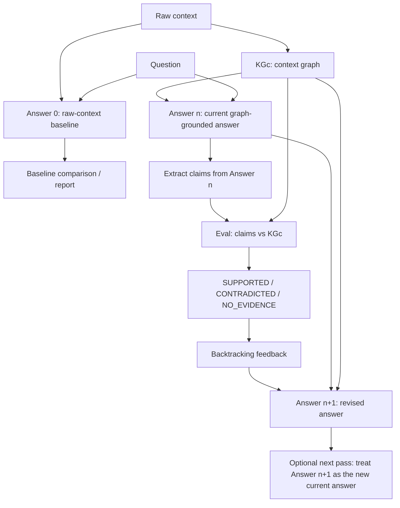

# KGc Backtracking Milestone Evidence

## Confirmed loop

1. Raw context + question → Answer(0)
   - **Answer(0):** raw-text baseline answer.
2. Raw context → KGc
   - **KGc:** graph built from the trusted context.
3. Question + KGc → Answer(n)
   - **Answer(n):** current graph-grounded answer produced using KGc, not raw text.
4. Eval(Answer(n), KGc) → labels
5. Labels → backtracking feedback
6. Feedback + Answer(n) + KGc → Answer(n+1)
   - **Answer(n+1):** revised answer after KGc evaluation and backtracking.
   - If multiple iterations are used later, Answer(n+1) becomes the next current Answer(n), and the eval/backtracking loop repeats (`current_answer = revised_answer`).

## Minimal diagram



Raw context does **not** feed Answer(n). It feeds Answer(0) and KGc construction only.

Answer(n+1) does not flow backward into an older answer. If another iteration is used, the revised answer is simply treated as the next current answer and evaluated again (`current_answer = revised_answer`).

## Where the information comes from

| Artifact | Comes from | Purpose |
|----------|------------|---------|
| Answer(0) | Raw context + question, or example `initial_answer` | Baseline comparison |
| KGc | Triples/facts extracted from trusted context | Structured evidence source |
| Answer(n) | Question answered using serialized KGc facts | Current graph-grounded answer being evaluated |
| Claims from Answer(n) | Triple extraction over Answer(n) | Things to compare against KGc |
| Labels | `GraphComparator` compares claims to KGc | SUPPORTED / CONTRADICTED / NO_EVIDENCE |
| Feedback | Labels + matching/conflicting KGc facts | Backtracking instructions |
| Answer(n+1) | Answer(n) + feedback + KGc | Revised answer |

## Example: Hyundai

**Context:**  
"The 2018 Hyundai Sonata SE has a 2.4L engine and was assembled in Alabama."

**Answer(0):**  
"The 2018 Hyundai Sonata SE has a 2.4L turbo engine and was assembled in Korea."

**KGc:**

- has_engine → 2.4L engine
- assembled_in → Alabama

**Answer(n):**  
"The 2018 Hyundai Sonata SE has a 2.4L engine and was assembled in Alabama."

**Eval:**

- has_engine → SUPPORTED
- was_assembled_in → SUPPORTED after relation normalization to assembled_in

**Answer(n+1):**  
"The 2018 Hyundai Sonata SE has a 2.4L engine and was assembled in Alabama."

This shows the scaffold preserving a graph-grounded answer when its claims match KGc.

## Test evidence

**Command:**

```bash
./scripts/run-kgc-tests.sh
```

**Result:** 10 passed, 0 failed

| Test group | Verifies | Result |
|------------|----------|--------|
| Graph comparator | support, relation normalization, contradiction, no evidence | PASS |
| Backtracking feedback | preserve supported, correct contradicted, flag no evidence | PASS |
| End-to-end mock flows | Hyundai graph-grounded flow; drone schema alignment + genuine no-evidence | PASS |

Tests use MockProvider and controlled facts/answers, so they are deterministic and do not require Ollama, Neo4j, or the frontend.

The UI/API now exposes trace information showing where each artifact comes from and how each Answer(n) claim is evaluated against KGc before producing Answer(n+1).

Developer pytest: `pytest tests/ -v --tb=short`

## Current scope

**Implemented:**

- KGc construction
- KGc-based Answer(n)
- Eval(Answer(n), KGc)
- SUPPORTED / CONTRADICTED / NO_EVIDENCE labels
- backtracking feedback
- Answer(n+1)
- tests

**Not yet implemented:**

- full RAG/adjudication
- advanced entity resolution
- multi-hop reasoning
- full multi-iteration evaluation beyond the current scaffold
