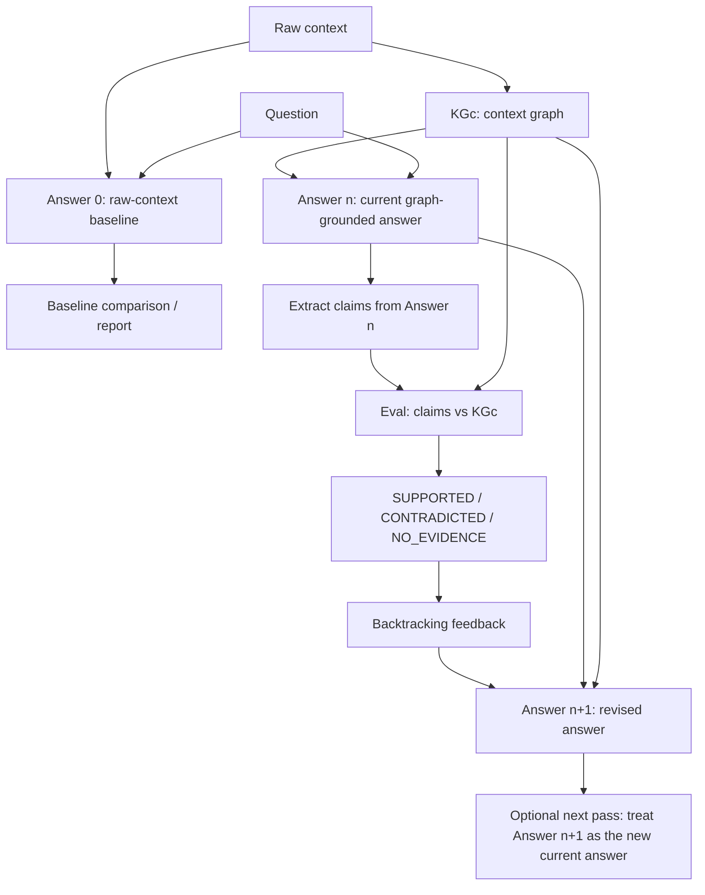

# KGc Backtracking Milestone Evidence

## Confirmed loop

1. Raw context + question → Answer(0)
   - **Answer(0):** raw-text baseline answer.
2. Raw context → KGc
   - **KGc:** graph built from the trusted context.
3. Question + KGc → Answer(n)
   - **Answer(n):** current graph-grounded answer produced using KGc, not raw text.
4. Eval(Answer(n), KGc) → labels
5. Labels → backtracking feedback
6. Feedback + Answer(n) + KGc → Answer(n+1)
   - **Answer(n+1):** revised answer after KGc evaluation and backtracking.
   - If multiple iterations are used later, Answer(n+1) becomes the next current Answer(n), and the eval/backtracking loop repeats (`current_answer = revised_answer`).

## Minimal diagram



Raw context does **not** feed Answer(n). It feeds Answer(0) and KGc construction only.

Answer(n+1) does not flow backward into an older answer. If another iteration is used, the revised answer is simply treated as the next current answer and evaluated again (`current_answer = revised_answer`).

## Where the information comes from

| Artifact | Comes from | Purpose |
|----------|------------|---------|
| Answer(0) | Raw context + question, or example `initial_answer` | Baseline comparison |
| KGc | Triples/facts extracted from trusted context | Structured evidence source |
| Answer(n) | Question answered using serialized KGc facts | Current graph-grounded answer being evaluated |
| Claims from Answer(n) | Triple extraction over Answer(n) | Things to compare against KGc |
| Labels | `GraphComparator` compares claims to KGc | SUPPORTED / CONTRADICTED / NO_EVIDENCE |
| Feedback | Labels + matching/conflicting KGc facts | Backtracking instructions |
| Answer(n+1) | Answer(n) + feedback + KGc | Revised answer |

## Example: Hyundai

**Context:**  
"The 2018 Hyundai Sonata SE has a 2.4L engine and was assembled in Alabama."

**Answer(0):**  
"The 2018 Hyundai Sonata SE has a 2.4L turbo engine and was assembled in Korea."

**KGc:**

- has_engine → 2.4L engine
- assembled_in → Alabama

**Answer(n):**  
"The 2018 Hyundai Sonata SE has a 2.4L engine and was assembled in Alabama."

**Eval:**

- has_engine → SUPPORTED
- was_assembled_in → SUPPORTED after relation normalization to assembled_in

**Answer(n+1):**  
"The 2018 Hyundai Sonata SE has a 2.4L engine and was assembled in Alabama."

This shows the scaffold preserving a graph-grounded answer when its claims match KGc.

## Test evidence

**Command:**

```bash
./scripts/run-kgc-tests.sh
```

**Result:** 10 passed, 0 failed

| Test group | Verifies | Result |
|------------|----------|--------|
| Graph comparator | support, relation normalization, contradiction, no evidence | PASS |
| Backtracking feedback | preserve supported, correct contradicted, flag no evidence | PASS |
| End-to-end mock flows | Hyundai graph-grounded flow; drone schema alignment + genuine no-evidence | PASS |

Tests use MockProvider and controlled facts/answers, so they are deterministic and do not require Ollama, Neo4j, or the frontend.

The UI/API now exposes trace information showing where each artifact comes from and how each Answer(n) claim is evaluated against KGc before producing Answer(n+1).

Developer pytest: `pytest tests/ -v --tb=short`

## Current scope

**Implemented:**

- KGc construction
- KGc-based Answer(n)
- Eval(Answer(n), KGc)
- SUPPORTED / CONTRADICTED / NO_EVIDENCE labels
- backtracking feedback
- Answer(n+1)
- tests

**Not yet implemented:**

- full RAG/adjudication
- advanced entity resolution
- multi-hop reasoning
- full multi-iteration evaluation beyond the current scaffold

## Next milestone: decomposed iterative KGc (experimental)

Added alongside the stable monolithic demo:

- `DecomposedBacktrackingRunner` — split compound questions, iterate per sub-question, combine
- CSV structured extraction (JSON fallback) via `structured_output.py`
- `QuestionSplitter` with strict JSON validation
- Working KGc candidate-update scaffold (promotion disabled by default)
- API: `POST /run-decomposed-kgc-backtracking`
- UI tool mode: **Decomposed iterative KGc** (not default)
- Design doc: `docs/DECOMPOSED_ITERATIVE_KGC_DESIGN.md`
- Stress example: `apollo_complex`
- Generalization example: `patient_d_314_complex` (partially correct Answer(0); composite claim slots; medication-status families)

Stable regression fixture unchanged: `saturn_v_apollo_11_001` → 5 KGc facts, 4 claims, 1/3/0 labels.

---

## Final stabilization milestone (frozen)

**Summary:** The prototype now supports decomposing a compound question, projecting an external flawed Answer(0) into atomic sub-answers, enriching a working KGc from trusted context per sub-question, deterministically evaluating claims, revising and re-evaluating each answer until resolved or honestly stopped, and comparing decomposed processing against the monolithic baseline.

This does **not** claim hallucinations are prevented or KGc evolution is solved.

### Verification (2026-07-06)

| Check | Result |
|-------|--------|
| `pytest tests/` | **139 passed** |
| `npm run build` | **success** |
| Stable demo `saturn_v_apollo_11_001` | unchanged (mock regression) |
| Real-model runs | `scripts/stabilization_milestone_report.py --provider ollama --model gemma4:e2b --runs 3` |

### 3-run Ollama summary (`gemma4:e2b`, `preset_external_projected`)

Full JSON: `results/stabilization_milestone_report.json`

| Run | Projection | Retries | Resolved | Notes |
|-----|------------|---------|----------|-------|
| 1 | `deterministic_labeled_fields` | 0 | 3/5 | Q1 STALLED (NO_EVIDENCE on date); Q4 UNRESOLVED_NO_EVIDENCE |
| 2 | `deterministic_labeled_fields` | 0 | **4/5** | Q1–Q3, Q5 RESOLVED; Q4 STALLED (honest abstention) |
| 3 | `deterministic_labeled_fields` | 0 | **4/5** | Q1–Q3, Q5 RESOLVED; Q4 UNRESOLVED_NO_EVIDENCE |

**Projection integrity (all 3 runs):** all five flawed preset values preserved before correction (`1985`, wrong crew, airport, Trump, `7 ounces`).

### Monolithic vs decomposed (same example, same model)

| Metric | Monolithic | Decomposed (runs 2–3) |
|--------|------------|------------------------|
| Path | compound Q + compound Answer(0) | 5 atomic sub-Q + projected Answer(0) |
| Claims extracted | 5 | per sub-Q (1 each typical) |
| Final S/C/NE | 0/0/5 | 4/5 targets RESOLVED |
| Structured-output retries | 0 | 0 |
| Q4 president | mixed abstention in revision | honestly UNRESOLVED/STALLED |
| Combined answer | partial, many NO_EVIDENCE | Q1–Q3 + Q5 corrected; Q4 marked unresolved |

Prototype observation only — not statistically significant.

### Stabilization fixes

1. **Preset Answer(0) projection** — deterministic labeled-field parsing preserves flawed source values; LLM fallback with faithfulness validation
2. **Date-range normalization** — equivalent interval wording matches deterministically (`July 16-24` ≈ `July 16 to 24, 1969`)
3. **Collection-amount extraction** — stops at amount + material phrase; no trailing mission clauses
4. **Abstention detection** — no-information answers skip claim extraction; stop as `UNRESOLVED_NO_EVIDENCE`

### Successful behaviors

- Compound split → projected external Answer(0) → one sub-question at a time
- Focused trusted-context extraction + working KGc enrichment per sub-question
- Question-conditioned claim extraction + deterministic S/C/NE evaluation
- Question-target adequacy gate + evaluation frames
- Q2 subject canonicalization; Q3 clean correction loop
- Q4 does not falsely resolve via `spoke_with` / `fulfilled_goal_set_by` equivalence

### Observed failure modes / limitations

- Q4 president may remain unresolved without explicit on-target facts
- LLM structured-output still requires retries on some models
- Sub-answer combination is deterministic concatenation
- No LLM judge, embeddings, or temporal derivation in this milestone

### Preliminary monolithic vs decomposed comparison

See `results/stabilization_milestone_report.json` for per-run metrics. Prototype observation only — not statistically significant.

### Milestone frozen

Implementation stops here unless a true blocking defect remains.
