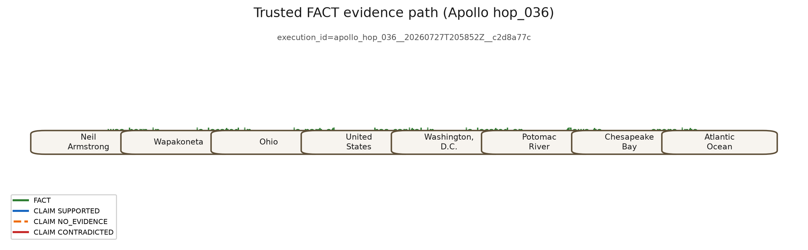
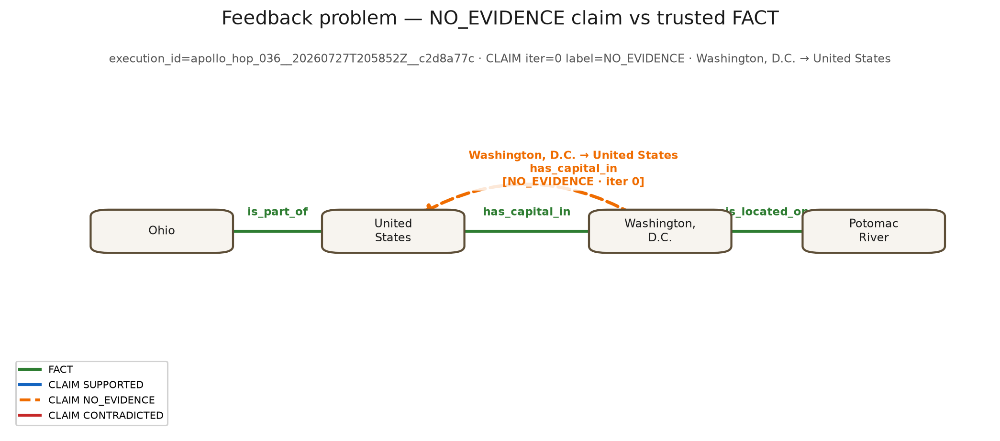
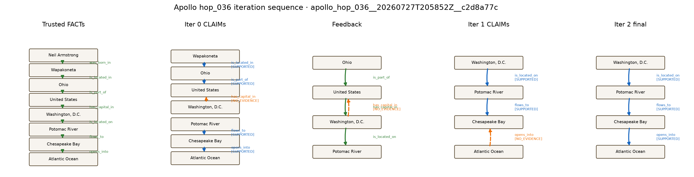

# Evaluating Graph-Based Feedback and Iterative Backtracking in GraphEval

Experiment Report — GraphEval Prototype Research Project
Author: Kyler Gundersen · Date: August 2026
Software state: branch `debug/8b-hop-validation`, commit `b9608d0f59b5dffd30d2f51aa50cc4be745dcc93`
Official experiment: `apollo_multihop_llama31_8b_20260727T203028Z` (2026-07-27)

Formatting note: the professor's `Experiment Template-verJuly272026.docx` was not
available in the analysis environment; this report follows the template's specified
section structure (Abstract; Introduction: Background, Objective; Methodology: Data
Collection, Experiment Setup, Procedure; Results; Discussion; Conclusion; References).

## Abstract

Large-language-model answers can mix supported, contradicted, and unsupported
statements, and conventional final-answer scoring hides how an answer changes during
self-correction. GraphEval is a prototype research instrument that decomposes a model
answer into subject–relation–object CLAIM triples, evaluates each claim against
trusted FACT triples extracted from context and persisted in Neo4j, labels every claim
SUPPORTED, CONTRADICTED, or NO_EVIDENCE, feeds the labels back for revision, and
validates a trusted evidence path before declaring an answer resolved. This report
describes the completed official experiment: a 50-question Apollo-domain multihop
benchmark (five questions at each designed graph-path depth 1–10) run with
`llama3.1:8b` via Ollama (temperature 0, 8192-token context, at most three iterations
per sub-question) at frozen commit `b9608d0`. All 50 questions completed with no
runtime errors or timeouts. 27/50 final answers matched the expected answer exactly
(54%), 43/50 contained it (86%), and the pipeline resolved 33/50 (66%) with a complete
trusted evidence path in 36/50. The dominant divergence was textually-correct-but-
pipeline-unresolved (15/50). All 27 questions resolved on the first pass were answered
correctly or near-correctly, while only 6 of the 23 questions that entered revision
ever resolved. Trace-level case studies show both successful feedback-driven
correction (a depth-8 question revised twice into an exactly correct, fully
path-validated answer) and a pipeline-mediated regression (a WannaCry depth-10
question whose initially correct bulletin identifier, MS17-010, was lost through
malformed decomposition, projection, and unsuccessful revision). A three-run repeatability
extension (the official run retained as Run 1 plus two exact-configuration
repetitions) found byte-identical final answers and identical scoring, resolution,
stop-reason, terminal-claim, and label outcomes on all 50 questions in all three
runs, with only wall-clock runtime varying — indicating that under this frozen
temperature-0 configuration on fixed hardware, single-run results were not
distorted by run-to-run sampling noise. The main limitations are the small
per-depth sample (five questions), a single model and domain for the quantitative
sample, possible output variation under changed environments that the fixed-
configuration repeatability sample cannot rule out, and the absence of a
controlled no-feedback baseline, which precludes causal claims about correction
efficacy.

## 1. Introduction

### 1.1 Background

An LLM answer to a multi-step factual question is typically scored only on its final
text. That practice hides several distinct behaviors: an answer can be textually
correct while resting on unverifiable reasoning; it can contain a correct entity
embedded in unsupported elaboration; and iterative self-correction can silently
remove correct information as easily as it removes errors. Understanding these
behaviors requires a representation in which individual statements can be inspected,
rejected, preserved, or replaced.

The broader motivation of this project is structured memory and correction: how an
AI system represents the information in its answers, what it preserves during
correction, what it forgets or removes, and how incorrect information persists.
The GraphEval prototype studied here is not a complete conversational-memory system;
it is an experimental instrument for observing answer decomposition, claim
evaluation, preservation, revision, and failure at the level of individual triples.

The instrument keeps two concepts strictly separate. A FACT is a
subject–relation–object triple extracted from trusted context, treated as trusted
evidence, stored as a FACT relationship in Neo4j, and usable in evidence-path
validation. A CLAIM is a triple extracted from a model answer; it is evaluated
against trusted FACTs and labeled SUPPORTED, CONTRADICTED, or NO_EVIDENCE, and it
remains a CLAIM even when supported — the pipeline never promotes a supported claim
into a FACT. A triple is Subject — Relation → Object; for example,
`Microsoft Security Bulletin MS17-010 — supplied_correction_to_vulnerability → how
SMBv1 handled crafted requests`.

The prototype follows the GraphEval idea of verifying LLM output as a knowledge
graph rather than as free text. [TODO: verify and cite the original GraphEval
publication; the repository does not record the source, and no attribution is
invented here.]

### 1.2 Objective

The experiment is descriptive. Its research questions are:

- **RQ1.** How reliably does GraphEval produce textually correct and graph-resolved
  answers across designed graph-path depths 1 through 10?
- **RQ2.** During iterative revision, how does GraphEval handle claims labeled
  SUPPORTED, CONTRADICTED, and NO_EVIDENCE?
- **RQ3.** Which observed failures originate primarily in the LLM, which originate
  in the GraphEval pipeline, and which are mixed failures involving both?
- **RQ4.** What does the trace reveal about preservation, correction, removal, or
  regression of answer information between the initial and final response?

The main objective is therefore to evaluate final textual correctness,
graph-grounded resolution, behavior across depth, claim-label feedback, preservation
and regression during revision, and observable model and pipeline failure modes.
Because the experiment contains no controlled no-feedback or text-only-feedback
baseline, no causal claim is made that graph feedback outperforms ordinary
self-correction.

## 2. Methodology

This section describes the GraphEval algorithm as implemented at frozen commit
`b9608d0`, the Neo4j persistence model, claim evaluation, and the experiment
procedure. Implementation mappings, Cypher, and worked examples are recorded in
`research/METHODOLOGY_DOCUMENTATION_AUDIT.md`, `research/NEO4J_DATA_MODEL.md`, and
`research/ALGORITHM_WORKED_EXAMPLES.md`. Diagram sources live under
`docs/diagrams/`.

### 2.1 Research motivation and design rationale

Final-answer-only scoring collapses several distinct behaviors into a single string
match. An answer can contain the expected entity while resting on unverifiable
statements; it can mix supported and contradicted triples; and revision can remove
correct information as easily as it removes errors. GraphEval was selected as an
instrument because a subject–relation–object graph makes those components
inspectable.

FACTS and CLAIMS are kept separate by design. A FACT is extracted from supplied
trusted context and treated as trusted evidence for comparison and path checks. A
CLAIM is extracted from a model answer and is labeled against FACTs; a supported
CLAIM remains a CLAIM and is never rewritten as a FACT relationship. That
separation is what makes preservation, contradiction, and regression observable
during correction and backtracking. Optional question decomposition is part of the
instrument but was not a separately controlled experimental condition. Because the
study includes no controlled no-feedback or generic-self-correction baseline, the
results support feasibility and case-level correction evidence only; they do not
prove that graph feedback outperforms those alternatives.

### 2.2 Triple representation

Every FACT and CLAIM is a subject–relation–object triple. Examples from preserved
artifacts:

- FACT: `Global Ocean — is_studied_by → Oceanography`
  (Apollo post-fix trace `apollo_hop_046__20260727T202312Z__50843932`)
- FACT: `Microsoft Security Bulletin MS17-010 — supplied_correction_to_vulnerability → how SMBv1 handled crafted requests`
  (WannaCry `…4adc0f88`)
- CLAIM (SUPPORTED): same MS17-010 triple as above, extracted from an answer
- CLAIM (CONTRADICTED): MS17-010 with an over-expanded object describing remote
  code execution (same WannaCry execution)
- CLAIM (NO_EVIDENCE): `WannaCry ransomware campaign — affected_by_final_fix → patching`

Extraction output is validated as structured triples. Malformed triples are
rejected or recorded as anomalies (for example empty objects via
`structured_triple_anomaly` / `empty_object` events). Schema alignment
(`align_claims_to_kgc_schema`) may rewrite claim fields toward canonical KGc
vocabulary under deterministic bounds; it does not invent trusted FACTs.

### 2.3 Neo4j data model and persistence

Neo4j stores execution-scoped `:Entity` nodes linked by `:FACT` and `:CLAIM`
relationships (exact labels and properties: `src/storage/neo4j_store.py`,
`research/NEO4J_DATA_MODEL.md`; conceptual schema diagram:
`docs/diagrams/rendered/neo4j_logical_schema.svg`).

Each run receives a unique `execution_id`. FACTs are written with `MERGE`; CLAIMs
are written with `CREATE` after each sub-question finishes, once per iteration in
that sub-question’s history, so earlier-iteration CLAIMs **coexist** with later
ones rather than being replaced. Labels are computed in Python
(`GraphComparator`) and stored on CLAIM edges when persistence is enabled. Neo4j
does not assign labels, does not decide stop reasons, does not run the evidence-path
verdict used by the runner, and never promotes CLAIMs to FACTs.

For the professor-facing Neo4j visuals in Figures M2–M5, all graph drawings except
Figure M5 are **controlled-layout renderings** of relationships queried from the
live execution-scoped Neo4j graph for the July 27 official Apollo question
`apollo_hop_036` (execution
`apollo_hop_036__20260727T205852Z__c2d8a77c`). They are **not** Neo4j Browser
screenshots. Full audit, Cypher, and captions:
`research/neo4j_figures/APOLLO_036_NEO4J_AUDIT.md`,
`research/neo4j_figures/FIGURE_CAPTIONS.md`.

### 2.4 GraphEval algorithm

In ordinary language, GraphEval does the following for one question. It loads the
question and trusted context. It may split the question into sub-questions (LLM,
then Python validation). It extracts FACT triples from context (LLM), validates
them (Python), writes them to Neo4j, and may read them back into the working graph.
It generates an answer and projects it onto each sub-question (LLM). For each
sub-question it repeatedly: extracts CLAIMs (LLM), aligns them (Python), compares
them to FACTs and assigns labels (Python), checks target satisfaction and a trusted
evidence path (Python), builds feedback (Python), and either stops or revises the
answer (LLM) up to the iteration limit. After each sub-question it appends CLAIM
edges for every iteration in history. It then combines sub-answers and, outside the
inference loop, scores the final text against the expected answer.

*Figure M1. Conceptual GraphEval algorithm diagram (not Neo4j data). Simplified
view of `DecomposedBacktrackingRunner` / `KgcIterationEngine`. Tan = LLM; blue =
deterministic Python; green = Neo4j read/write; gray = post-inference scoring.*

*Figure M2. Controlled-layout rendering of trusted FACT relationships queried
directly from the execution-scoped Neo4j graph for
`apollo_hop_036__20260727T205852Z__c2d8a77c` (path entities from Neil Armstrong to
Atlantic Ocean). Green solid edges are FACTs only. Not a Neo4j Browser screenshot.*

Numbered stages (implementation references in parentheses):

1. Begin `ExecutionScope` → unique `execution_id`
   (`src/pipeline/execution_context.py`).
2. Optional `clear_execution` for that id only (`Neo4jStore.clear_execution`).
3. Optional question split (LLM) + validation (Python).
4. Context FACT extraction (LLM) + structured validation (Python).
5. Neo4j WRITE FACTs (`store_kgc_facts` / MERGE).
6. Optional Neo4j READ FACTs into working KGc.
7. Initial answer and sub-answer projection (LLM).
8. Claim extract (LLM) → schema align (Python) → `GraphComparator.compare_claims`
   (Python).
9. Optional focused/derived FACT enrichment (LLM extract + Python gates; later
   working FACT writes).
10. Target satisfaction + evidence-path resolution (Python).
11. Feedback (Python) → revise (LLM) or stop (`determine_stop_reason`).
12. Neo4j WRITE CLAIMs for each history iteration (`CREATE` append).
13. Combine sub-answers; optional working FACT persistence.
14. Post-inference textual scoring against expected answers (benchmark runner /
    analyzers only).

Inputs at inference time are the question and trusted context (plus model/provider
settings). Expected answers and expected paths are **not** inputs to inference
(`tests/test_expected_answer_leakage.py`).

### 2.5 Claim evaluation

`GraphComparator.compare_claims` labels each CLAIM:

| Label | Implemented decision (summary) | Real example |
|---|---|---|
| SUPPORTED | Exact (S,R,O) match to a FACT, or target-frame match (compatible subject/relation family/object) | Apollo hop_036 final: `Chesapeake Bay — opens_into → Atlantic Ocean` |
| CONTRADICTED | Same subject+relation (legacy) or same target-frame family with conflicting object; also polarity/engine helpers | WannaCry qualitative: MS17-010 object over-expansion vs FACT `how SMBv1 handled crafted requests` |
| NO_EVIDENCE | No matching or conflicting FACT under the active rules | Apollo hop_036 iter 0: `Washington, D.C. — has_capital_in → United States` (reversed vs FACT) |

When a `QuestionTarget` supplies `expected_relations`, comparison uses the
target-frame path (relation families and object compatibility). Otherwise the
legacy exact/(S,R) indexes apply. Details and full triples:
`research/ALGORITHM_WORKED_EXAMPLES.md`.

*Figure M3. Controlled-layout rendering of relationships queried directly from the
execution-scoped Neo4j graph for
`apollo_hop_036__20260727T205852Z__c2d8a77c`. Green FACT
`United States — has_capital_in → Washington, D.C.` versus orange dashed CLAIM
`Washington, D.C. — has_capital_in → United States` labeled NO_EVIDENCE. This is
not a Neo4j Browser screenshot.*

### 2.6 Feedback and revision loop

`BacktrackingFeedbackBuilder.build` creates a feedback item for each evaluated
claim. SUPPORTED claims are instructed to be preserved; CONTRADICTED claims are
instructed to be corrected using the conflicting FACT object; NO_EVIDENCE claims
are instructed to be omitted or marked for later retrieval. The reviser LLM
receives that structured feedback and produces Answer(n+1). Iteration state that
matters for stopping includes the answer text, the evaluation signature, label
counts, target satisfaction, evidence-path completeness, and whether new working
FACTs were added.

Stop outcomes are decided by `determine_stop_reason` in
`src/pipeline/kgc_iteration.py`. Broadly: RESOLVED requires no CONTRADICTED/NO_EVIDENCE
labels, a satisfied target, and an evidence path that is not incomplete; STALLED
covers unchanged answers/claims under remaining defects; UNRESOLVED_NO_EVIDENCE and
UNRESOLVED_TARGET_NOT_SATISFIED name the dominant defect; MAX_ITERATIONS applies when
the budget (official experiment: 3 per sub-question) is exhausted without a cleaner
stop. After the loop, CLAIM edges for **all** iterations in the sub-question history
are appended to Neo4j.

### 2.7 Target and evidence-path validation

Textual correctness (exact / contains expected) is computed **after** inference and
is not the same as pipeline resolution. Pipeline resolution requires the
deterministic stop verdict RESOLVED. That verdict depends on claim labels plus:

- **Semantic target:** `derive_question_target` / `evaluate_target_satisfaction` —
  whether supported claims address the sub-question’s intended relation/subject
  frame.
- **Trusted path:** `resolve_evidence_path` walks trusted FACT edges from a start
  entity to a terminal claim (preferring a matched FACT for a SUPPORTED claim).
  Failure reasons observed in results include `missing_intermediate_edge` and
  `terminal_claim_not_a_trusted_fact`.
- **Terminal claim:** the structured edge used as the path endpoint (see official
  `apollo_hop_036` terminal claim `Chesapeake Bay — opens_into → Atlantic Ocean`).

### 2.8 Complete worked execution

**Primary Neo4j visual case (official Apollo hop_036).** Execution
`apollo_hop_036__20260727T205852Z__c2d8a77c` (July 27 official run; August
repeat executions for the same question exist in Neo4j but were not used for
figures). Result JSON: final answer `Atlantic Ocean`, exact match, RESOLVED after
3 iterations / 2 revisions, final labels 3 SUPPORTED / 0 / 0, complete 7-edge
trusted path ending at `Chesapeake Bay — opens_into → Atlantic Ocean`.

Official-run debug answer text and feedback strings were **not** persisted
(`debug_log_path: null`). However, Neo4j **did** retain coexisting CLAIM edges for
iterations 0, 1, and 2 (CREATE append). Live audit (46 FACT, 11 CLAIM; two
NO_EVIDENCE claims at iterations 0 and 1):
`research/neo4j_figures/APOLLO_036_NEO4J_AUDIT.md`. Stored CLAIM state supports a
genuine revision reading: reversed capital claim (NO_EVIDENCE) → later
`is_located_on` / path claims → final SUPPORTED terminal at Atlantic Ocean.
Panels below are labeled from stored CLAIM/FACT properties only; intermediate
answer text is not reconstructed.

*Figure M4. Controlled-layout multi-panel rendering of FACT and CLAIM
relationships queried directly from
`apollo_hop_036__20260727T205852Z__c2d8a77c`. Trusted FACTs → iteration-0 CLAIMs
→ focused NO_EVIDENCE feedback → iteration-1 CLAIMs → iteration-2 final SUPPORTED
state. Not a Neo4j Browser screenshot.*

**Literal Neo4j Browser proof (implementation evidence only).** Figure M5 is the
one literal Neo4j Browser screenshot. It does not explain the algorithm; it only
shows that FACT/CLAIM relationships for this execution exist in the running
database. Capture instructions and Cypher:
`research/neo4j_figures/FIGURE_CAPTIONS.md` (section `neo4j_browser_apollo_execution`)
and `research/NEO4J_SCREENSHOT_GUIDE.md`.

*Figure M5. Literal Neo4j Browser screenshot for execution
`apollo_hop_036__20260727T205852Z__c2d8a77c` (FACT + CLAIM subset). If this file
is not yet present, capture it once using the Cypher in
`research/neo4j_figures/FIGURE_CAPTIONS.md` — do not substitute a Graphviz
rendering.*

**Qualitative WannaCry trace (answer-text sequence, not the primary Neo4j visual).**
Execution `nhs_wannacry_h10_q01__20260727T214622Z__4adc0f88`, artifact
`.runtime/debug/20260727T214622Z_nhs_wannacry_h10_q01_attempt_70a052a7.jsonl`.
Trusted FACTs include the MS17-010 correction FACT. Q1 early claims labeled the
bulletin SUPPORTED; after revision the final Q1 claim was NO_EVIDENCE
(`… → patching`) and the sub-question stopped UNRESOLVED_NO_EVIDENCE. Q2 retained
some SUPPORTED MS17-010 claims while over-expanded objects were CONTRADICTED;
sub-question stopped STALLED. This case is **not** part of the Apollo n=50 rates
and is not used as the primary Neo4j figure sequence.

**Clean SUPPORTED (post-fix Apollo trace).**
`apollo_hop_046__20260727T202312Z__50843932`: claim
`Global Ocean — is_studied_by → Oceanography` SUPPORTED; RESOLVED in one iteration.

### 2.9 Experiment procedure and scoring

**Primary quantitative dataset.** The Apollo 50-question multihop benchmark
(`data/test_sets/apollo_multihop_50.json`) contains 50 questions over a fixed
designed knowledge graph of Apollo/NASA public history: 42 nodes, 48 edges, one
connected component, rooted at `Apollo 11`, with exactly five questions at each
designed depth 1–10 (validator-confirmed inside the result file). Designed hop depth
means root-to-answer graph-path depth in this fixed graph; it does not force a
number of visible reasoning statements, does not equal the number of LLM calls, and
is separate from question decomposition. Each question carries trusted context and
an expected answer and expected path used only for post-inference scoring.

**Qualitative case data.** The WannaCry execution above is analyzed separately and
never pooled with the Apollo sample. Representative cases were selected from
existing artifacts; no new model outputs were generated for this methodology
revision and no unfavorable rows were rerun.

No human participants were involved.

**Experiment setup** (verified from result JSON, runner logs, and
`research/EXPERIMENT_EVIDENCE_INVENTORY.md`):

| Item | Value |
|---|---|
| Frozen commit | `b9608d0f59b5dffd30d2f51aa50cc4be745dcc93` (branch `debug/8b-hop-validation`) |
| Model / provider | `llama3.1:8b` via Ollama (LLM stages) |
| Context window | `num_ctx` 8192; max observed prompt ≈ 1670 tokens (limit never approached) |
| Sampling | temperature 0; `num_predict` 4096 |
| Iteration limit | 3 per sub-question |
| Timeout | 180 s per question |
| Graph store | Neo4j 5.26.0 (Docker), required, execution-scoped; claim evaluation via Neo4j readback in all 50 rows; clearing configured between questions via `--clear-neo4j` / per-execution clear |
| Runner | `scripts/run_multihop_benchmark.py` (`--continue-on-error`, cooldown 2 s) |
| Outputs | `results/research/apollo_multihop_llama31_8b_20260727T203028Z.{json,md}` |
| Host | local WSL2/Ubuntu workstation running Ollama; detailed hardware was not recorded in run artifacts and is not claimed |

**Instrument validation before the experiment.** The offline test suite passed at
the frozen commit (PR #5 reported 406 passed / 16 skipped, with focused reliability
tests 26 passed and related pipeline tests 93 passed / 1 skipped; re-verified in
the analysis pass with `430 passed, 16 skipped` — the additional 24 tests come from
an untracked behavior-suite test file added after the freeze). Live Apollo
depth-1/2/3/10 acceptance runs succeeded after the reliability correction
(`.runtime/benchmarks/apollo_depth_acceptance*`), and Neo4j execution isolation and
FACT/CLAIM separation are covered by dedicated tests.

**Scoring and analysis.** After inference, the benchmark runner records exact match,
contains-expected, pipeline resolution, path completeness, stop reason, and label
counts. Quantitative aggregates were recomputed by
`scripts/analyze_final_experiment.py` (hard-fail on disagreement with the runner
summary; all values agreed). Figures:
`scripts/plot_final_experiment.py`. Qualitative analysis used preserved JSONL
traces (`research/REPRESENTATIVE_TRACE_CASES.md`).

## 3. Results

### 3.1 Overall results

All 50 questions completed; 0 errors, 0 timeouts, 0 resumed checkpoints. Total 83
sub-question iterations and 33 revisions. Runtime per question: min 37.5 s, Q1
40.9 s, median 44.9 s, Q3 52.8 s, max 72.5 s, mean 48.4 s.

| Metric (n = 50) | Count | Rate | Wilson 95% CI |
|---|---|---|---|
| Exact match | 27 | 0.54 | [0.40, 0.67] |
| Contains expected | 43 | 0.86 | [0.74, 0.93] |
| Normalized match | 43 | 0.86 | [0.74, 0.93] |
| Pipeline resolved | 33 | 0.66 | [0.52, 0.78] |
| Complete trusted evidence path | 36 | 0.72 | [0.58, 0.83] |

These five measures are distinct: exact match and contains-expected are textual
post-hoc scores; pipeline resolution is the deterministic verdict; path completeness
and target satisfaction are its two main components. They must not be conflated —
contains-expected in particular does not mean the final answer was ideal.

### 3.2 Stop reasons

| Final stop reason | Count |
|---|---|
| RESOLVED | 33 |
| STALLED | 7 |
| UNRESOLVED_TARGET_NOT_SATISFIED | 7 |
| UNRESOLVED_NO_EVIDENCE | 3 |

(Target satisfaction is observable through the UNRESOLVED_TARGET_NOT_SATISFIED stop
reason; rows do not carry a separate boolean.)

### 3.3 Joint textual correctness × pipeline resolution

| Joint outcome | Contains-expected basis | Exact-match basis |
|---|---|---|
| Textually correct and pipeline resolved | 28 | 27 |
| Textually correct but pipeline unresolved | 15 | 0 |
| Textually incorrect but pipeline resolved | 5 | 6 |
| Textually incorrect and pipeline unresolved | 2 | 17 |

The dominant divergence is textually-correct-but-unresolved (15/50): the model's
text contained the expected entity, but the pipeline could not assemble a supported,
target-satisfying, path-complete structured account of it. The reverse divergence
(resolved but textually wrong, 5/50) shows honest graph resolution landing on the
wrong semantic target (e.g. case `apollo_hop_037`, final answer "state").
The runner's `resolved_and_matched_count` of 28 uses its permissive `answer_match`
flag; the strict exact-and-resolved count is 27.

### 3.4 Results by designed depth

Five questions per depth: counts below are descriptive and do not establish
statistical depth trends.

| Depth | Exact | Contains | Resolved | Path complete | Avg iterations | Avg revisions | Mean runtime (s) |
|---|---|---|---|---|---|---|---|
| 1 | 4/5 | 5/5 | 4/5 | 4/5 | 1.2 | 0.2 | 40.7 |
| 2 | 3/5 | 5/5 | 3/5 | 4/5 | 1.6 | 0.6 | 46.9 |
| 3 | 3/5 | 3/5 | 4/5 | 4/5 | 1.4 | 0.4 | 43.4 |
| 4 | 2/5 | 4/5 | 2/5 | 4/5 | 1.8 | 0.8 | 52.0 |
| 5 | 4/5 | 4/5 | 5/5 | 5/5 | 1.4 | 0.4 | 47.7 |
| 6 | 4/5 | 5/5 | 4/5 | 4/5 | 1.4 | 0.4 | 46.8 |
| 7 | 1/5 | 4/5 | 2/5 | 2/5 | 1.8 | 0.8 | 48.1 |
| 8 | 1/5 | 4/5 | 3/5 | 3/5 | 2.2 | 1.2 | 53.9 |
| 9 | 3/5 | 4/5 | 4/5 | 4/5 | 2.0 | 1.0 | 52.0 |
| 10 | 2/5 | 5/5 | 2/5 | 2/5 | 1.8 | 0.8 | 52.6 |

Descriptively, exact match and resolution are high at depths 1–6 (except depth 4),
weaker at depths 7, 8, and 10, and contains-expected stays high at every depth
(3/5 at depth 3 is its only dip). Iterations and runtime drift upward with depth.
Depth-10 questions were resolvable: two resolved with complete nine-edge trusted
paths, including `apollo_hop_046` exactly ("Oceanography").

### 3.5 Revision behavior

| Group | Count | Exact | Contains | Resolved |
|---|---|---|---|---|
| First-pass (0 revisions) | 27 | 24 | 25 | 27 |
| Revised (≥ 1 revision) | 23 | 3 | 18 | 6 |

Resolution ends iteration, so first-pass rows are resolved by construction; the
table's information is that 24 of 27 first-pass resolutions were also exactly
correct. Of the 23 questions that entered revision, 6 eventually resolved, 17 ended
unresolved, and 5 still did not contain the expected answer. The official-run rows
do not store initial answers or per-iteration labels (`debug_log_path` is null), so
full initial-to-final answer-text transition matrices are not recoverable from the
official result JSON. For `apollo_hop_036`, earlier-iteration CLAIM edges do coexist
in Neo4j and were used for Figures M3–M4; answer text and feedback strings remain
unreconstructed. Broader per-question CLAIM transition matrices across all 50
questions were not exported from Neo4j for this report. This is a documented
instrument / export limitation, not an analysis choice.

### 3.6 Final claim labels

| Label | Total claims (final iterations) | Questions containing label |
|---|---|---|
| SUPPORTED | 65 | 44 |
| CONTRADICTED | 1 | 1 |
| NO_EVIDENCE | 12 | 10 |

At the final iteration the Apollo run was dominated by SUPPORTED claims;
CONTRADICTED was rare (one claim in one question). NO_EVIDENCE, present in 10
questions, is the label most associated with non-resolution. Official result JSON
does not retain per-iteration labels for all 50 questions (see 3.5). For the
selected Neo4j visual case `apollo_hop_036__20260727T205852Z__c2d8a77c`, CLAIM
edges for iterations 0–2 coexist in Neo4j (Figures M3–M4). The WannaCry debug
trace separately provides a fully observed answer-text example (initial SUPPORTED
MS17-010 claims, final 2 SUPPORTED / 4 CONTRADICTED / 1 NO_EVIDENCE).

### 3.7 Figures

- Figure 1 — `results/research/figures/fig1_outcomes_by_depth.png`: exact /
  contains / resolved counts by depth (five questions per depth; raw counts, no
  trend lines).
- Figure 2 — `fig2_joint_outcomes.png`: joint textual × pipeline outcomes.
- Figure 3 — `fig3_stop_reasons.png`: stop-reason distribution.
- Figure 4 — `fig4_revision_outcomes.png`: first-pass vs revised outcomes.

### 3.8 Representative trace cases

Full records in `research/REPRESENTATIVE_TRACE_CASES.md`; summary:

| Case | ID (depth) | Outcome | Classification |
|---|---|---|---|
| 1 | `apollo_hop_001` (1) | exact, RESOLVED, first pass | success baseline |
| 2 | `apollo_hop_046` (10) | exact, RESOLVED, 9-edge path, first pass | high-depth success |
| 3 | `apollo_hop_036` (8) | exact, RESOLVED after 2 revisions | successful feedback-driven revision (mixed) |
| 4 | `apollo_hop_005` (1) | contains, STALLED; degenerate claim `Apollo Program — includes → "The Apollo Program."` | mixed (extractor instability + literal deterministic handling) |
| 5 | `apollo_hop_007` (2) | contains, UNRESOLVED_NO_EVIDENCE despite supported complete path | primarily pipeline (conservative stop logic) |
| 6 | `apollo_hop_014` (3) | wrong answer, correctly not resolved (target not satisfied) | primarily model; pipeline behaved as designed |
| 7 | `apollo_hop_037` (8) | RESOLVED but final answer "state" (wrong) | primarily pipeline (target/combination semantics) |
| 8 | `apollo_hop_050` (10) | contains, unresolved (`missing_intermediate_edge`) | mixed |
| 9 | `nhs_wannacry_h10_q01` (10) | lost initially-correct MS17-010; UNRESOLVED/STALLED | mixed pipeline-mediated model regression |
| 10 | `apollo_hop_046` pre-fix vs post-fix | STALLED "Global Ocean" → RESOLVED "Oceanography" | instrument-development pair (pre-fix: pipeline) |

### 3.9 Repeatability and Nondeterminism

To quantify measurement stability, the identical experiment was executed two more
times on 2026-08-03 (UTC) as a bounded extension: the official run was retained
unmodified as Run 1, and Runs 2 and 3 were complete sequential repetitions using
the same frozen commit, dataset, model digest, Ollama build, Neo4j container, and
runner flags (verified by configuration cross-checks that hard-fail on any
mismatch; full protocol in `research/REPEATABILITY_PROTOCOL.md`). No question was
selectively rerun, and the three runs are treated as repeated measurements of the
same 50 questions, never as 150 independent questions.

| Metric (n=50 per run) | Run 1 (official) | Run 2 | Run 3 | Range |
|---|---|---|---|---|
| Completed / errors / timeouts | 50 / 0 / 0 | 50 / 0 / 0 | 50 / 0 / 0 | 0 |
| Exact match | 27 | 27 | 27 | 0 |
| Contains expected | 43 | 43 | 43 | 0 |
| Pipeline resolved | 33 | 33 | 33 | 0 |
| Evidence path complete | 36 | 36 | 36 | 0 |
| Iterations / revisions total | 83 / 33 | 83 / 33 | 83 / 33 | 0 |
| Final labels S/C/N | 65/1/12 | 65/1/12 | 65/1/12 | 0 |
| Runtime mean (s) | 48.42 | 46.73 | 45.79 | 2.63 |

Per-question comparison found complete stability on every compared dimension: all
50 questions produced byte-identical raw final answers and combined answers, and
identical exact-match, contains-expected, resolution, stop-reason, evidence-path,
terminal-claim, label-tuple, iteration, and revision outcomes in all three runs
(50/50 stable on each of the eight dimensions; all pairwise agreements 1.00).
Every stability category is therefore a stable_* category: 28
stable-correct-resolved, 15 stable-correct-unresolved, 5
stable-incorrect-resolved, 2 stable-incorrect-unresolved. Execution IDs and Neo4j
execution scopes were distinct in every run, confirming three genuinely
independent executions. The only varying quantity was wall-clock runtime (means
48.4 / 46.7 / 45.8 s; the largest per-question spread was 18.1 s on the first
question of each run, plausibly warm-up, though the artifacts do not isolate the
cause). Metrics with greatest variation: runtime only; all output metrics had
zero variation. Representative reproduced cases — including the depth-8
two-revision correction, the degenerate-extraction stall, and the
resolved-but-wrong "state" answer — are documented in
`research/REPEATABILITY_CASES.md`. Depth-level counts were likewise identical
across runs (each run contains only five questions per designed depth).

Implication for interpreting one-run results: under this fixed configuration the
official run's numbers are highly repeatable, and its failure modes are
systematic rather than sampling noise. Three runs on one machine cannot certify
determinism in general — outputs may still change across hardware, drivers,
Ollama versions, model builds, or concurrent load, and previously documented
variation between differently configured executions (the 2026-07-27 diagnostics)
shows outputs do change when conditions change.

## 4. Discussion

**What worked.** The instrument ran 50/50 questions with zero transport failures and
evaluated every question through Neo4j readback with execution-scoped isolation. Two
thirds of questions resolved with graph grounding, 72% produced a complete trusted
path, and designed ten-hop chains were traversable end-to-end (Cases 2 and 10
post-fix). The FACT/CLAIM separation held: nothing untrusted was promoted, and
every unresolved verdict in the examined cases was honest.

**What revision corrected and preserved.** Case 3 (`apollo_hop_036`) is the clearest
correction: two feedback-driven revisions converted an unresolved depth-8 answer
into an exactly correct, fully path-validated one. Stored Neo4j CLAIM edges for
`apollo_hop_036__20260727T205852Z__c2d8a77c` show an early NO_EVIDENCE reversed
capital claim and a later SUPPORTED terminal `Chesapeake Bay — opens_into → Atlantic Ocean`
(Figures M3–M4). In the WannaCry trace, the two SUPPORTED MS17-010 claims
persisted across Q2 iterations — supported information was preserved even while
the surrounding answer degraded.

**Where revision regressed.** Only 6 of 23 revised questions resolved, and revised
questions ended with far lower exact-match (3/23) than first-pass questions (24/27).
The WannaCry Q1 sequence shows the mechanism at trace level: a malformed
decomposition ("What was the final fix provided by in...") retargeted the task, the
revision replaced a bulletin-bearing answer with "patching", the resulting invented
relation (`affected_by_final_fix`) drew NO_EVIDENCE, and the correct identifier
never returned. Revision in this configuration is roughly as able to remove correct
information as to add it — an observation, given nondeterminism and sample size, not
a rate estimate.

**Why textual correctness exceeded pipeline resolution.** 86% contains-expected vs
66% resolved is explained by three trace-verified mechanisms: degenerate or
over-expanded claim extraction (Cases 4, 9), residual NO_EVIDENCE claims blocking an
otherwise supported answer (Case 5), and missing intermediate edges between the
start entity and a supported terminal claim (Case 8). These are mostly instrument
(pipeline or extractor) phenomena, not wrong answers.

**Depth.** Descriptively, depth 7–10 questions iterate more, run longer, and resolve
less often than depth 1–6 questions, but the pattern is not monotonic (depth 5 was
perfect for resolution; depth 3 had the lowest contains-expected) and five questions
per depth cannot establish a trend. The strongest supported statement is that
designed depth 10 is not a hard barrier: both resolved depth-10 rows produced
complete nine-edge trusted paths.

**Model vs tool.** Applying the first-unsupported-transformation rule: clear
model-side failures include wrong or evasive answers with failed recovery (Case 6)
and reversed or over-expanded claim extraction (Cases 4, 9, 10 pre-fix trigger).
Clear pipeline-side failures include unsafe alignment overwriting a correct terminal
claim (Case 10 pre-fix), target validation accepting a generic terminal object
(Case 7), conservative stop logic discarding a supported complete path (Case 5), and
the unresolved combiner projecting a wrong terminal object (Cases 7 and 10 pre-fix).
Mixed failures — malformed LLM decomposition accepted by deterministic validation,
over-expanded claims judged literally, accurate feedback followed by regressing
revision, thin trusted graphs bridged by unsupported claims — dominate the most
instructive cases (8, 9). The WannaCry case is classified as a mixed
pipeline-mediated model regression, not as evidence that an 8B model cannot answer a
ten-hop question: the same model produced the correct bulletin inside the same
execution.

**Repeatability, nondeterminism, and measurement stability.** In principle,
answer wording, decomposition, extracted triples, alignment candidates, and
revisions can vary between runs; a repeated execution is a new sample, not a
correction. The three-run extension (§3.9) measured this directly under the
frozen configuration and found zero output variation: all 50 questions reproduced
byte-identical answers and identical pipeline outcomes in three independent
executions six days apart, with only runtime varying. Two readings follow. First,
the official run's results — including its failure modes — are systematic under
these conditions, which strengthens the trace-level failure analysis: the
degenerate extraction of Case 4 and the "state" resolution of Case 7 recur
identically rather than appearing sporadically. Second, the stability is
conditional: it was observed at temperature 0 on one machine with one model
digest and one Ollama build, and it does not extend to changed conditions (the
differently configured 2026-07-27 diagnostics produced different outputs for the
same questions, and the WannaCry qualitative case ran under its own
configuration). The problematic WannaCry execution was deliberately not rerun;
pre-fix and post-fix runs were never pooled; and the three repeatability runs
were never pooled into 150 independent questions.

**Contribution.** The evidence supports a technical contribution — a working
decomposed graph-based backtracking instrument with structured claim-level feedback,
strict FACT/CLAIM separation, execution-scoped Neo4j persistence, target and
evidence-path validation, full traceability, benchmark tooling, and the reliability
safeguards frozen at `b9608d0` (Case 10 documents the concrete alignment-drift fix).
It also supports a modest research contribution: the textual-correctness vs
graph-resolution distinction is measurable and large (86% vs 66%); correction and
regression during revision are directly observable at claim level; and graph
feedback exposed information loss (Case 9) that final-answer-only evaluation would
hide — even in a case where it failed to repair the loss. No claim of broad
generalizability is made: one model, one quantitative domain, one configuration
(measured in triplicate by §3.9).

## 5. Conclusion

A frozen build of the GraphEval prototype executed the official 50-question
Apollo multihop benchmark cleanly (50/50, zero errors), producing 54% exact-match,
86% contains-expected, and 66% pipeline-resolved outcomes with complete trusted
paths in 72% of questions. The gap between textual correctness and graph resolution,
the honest refusal to resolve unsupported answers, and trace-visible preservation,
correction, and regression during revision are the experiment's principal findings.
Ten-hop designed chains were resolvable, and the most informative failure — the
WannaCry case — demonstrates precisely the kind of information-loss visibility that
motivates graph-grounded evaluation. A three-run repeatability
extension reproduced every output of the official run exactly (only runtime
varied), so the reported numbers and failure modes are stable properties of this
configuration rather than single-run sampling noise. The evidence base remains
deliberately bounded: five questions per depth, a single model, a single
quantitative domain, no controlled self-correction baseline, and repeatability
established only for the fixed configuration on one machine.

Immediate future work, kept separate from the completed scope: a controlled
comparison of initial answers, generic self-correction, and graph-feedback
correction; repeatability trials across environments, model builds, and non-zero
temperatures (fixed-configuration repeatability is established by §3.9, but
cross-environment stability is not); additional models and domains; stronger
decomposition validation (Case 9's malformed sub-question passed validation);
improved trace summarization; and preparation of a publication or poster from
this skeleton.

## 6. References

1. GraphEval prototype repository: `grapheval_prototype`, branch
   `debug/8b-hop-validation`, commit `b9608d0f59b5dffd30d2f51aa50cc4be745dcc93`
   (implementation, benchmark tooling, and all result artifacts cited in this report).
2. [TODO — original GraphEval publication: the repository describes the system as
   "GraphEval-style" but does not record the source; attribution must be verified
   before submission.]
3. UK National Audit Office, *Investigation: WannaCry cyber attack and the NHS*,
   HC 414, 25 April 2018. (WannaCry benchmark grounding.)
4. Department of Health & Social Care / NHS CIO, *Lessons learned review of the
   WannaCry Ransomware Cyber Attack*, 1 February 2018.
5. CISA / US-CERT, Alert TA17-132A: *Indicators Associated With WannaCry
   Ransomware*, May 2017.
6. Microsoft, *Microsoft Security Bulletin MS17-010 — Critical: Security Update for
   Microsoft Windows SMB Server*, 14 March 2017.
7. Project analysis artifacts: `results/research/grapheval_final_experiment_analysis.{json,md}`;
   `research/REPRESENTATIVE_TRACE_CASES.md`; `research/EXPERIMENT_PROTOCOL.md`;
   `research/REPRODUCIBILITY_RECORD.md` (this repository, 2026-08-02).
8. Repeatability extension artifacts:
   `results/research/repeatability/apollo_repeat_run{2,3}_llama31_8b_<UTCSTAMP>.{json,md}`;
   `results/research/repeatability/grapheval_repeatability_analysis.{json,md}`;
   `research/REPEATABILITY_PROTOCOL.md`; `research/REPEATABILITY_CASES.md`
   (this repository, 2026-08-03).
